class: middle, center, slide-invert-colors

.box.left.size100.bold[WarsawJS Workshop #???]
.box.right[]

---

class: middle, center, slide-card-list, slide-card-list-rounded

.size50[

# Organizers and Volunteers 1/2

]

.card[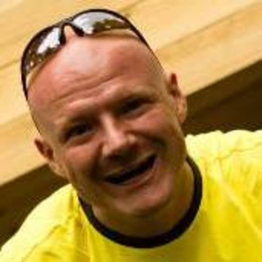 Łukasz Basaj]
.card[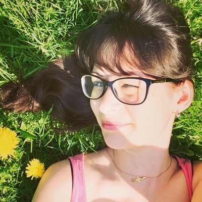 Tatiana Platonova]

.card[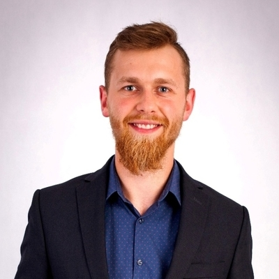 Mirosław Stasiak]
.card[ Anna Lukianova]

<!-- .card[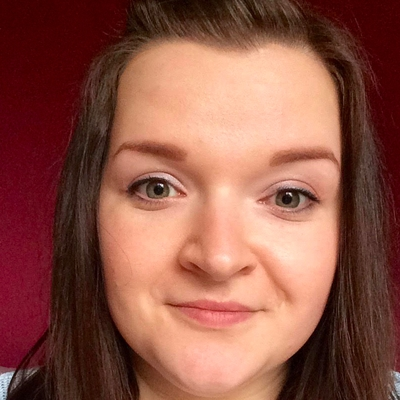 Kinga Wigurska-Bąk] -->
<!-- .card[ Tomasz Budrewicz] -->

---

class: middle, center, slide-card-list, slide-card-list-rounded

.size50[

# Organizers and Volunteers 2/2

]

.card[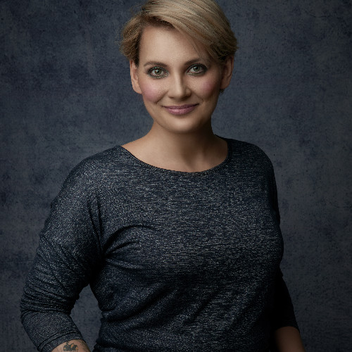 Anna Dławichowska]
.card[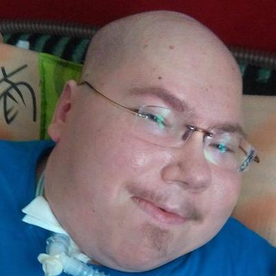 Maciej Machniewski]

.card[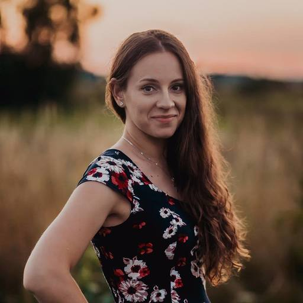 Anna Ambroziak]
.card[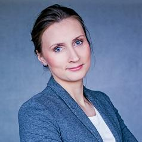 Natalia Kędziora]

<!-- .card[ Kinga Wigurska-Bąk] -->
<!-- .card[ Tomasz Budrewicz] -->

---

class: middle, center, slide-card-list, slide-card-list-rounded

.size50[

# 👨‍🏫 Trainers and Volunteers 👨‍🏫

]

.card[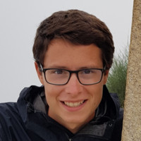 Daniel Karski]
.card[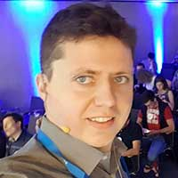 Marcin Hagmajer]

.card[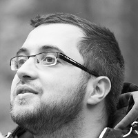 Kamil Grabek]
.card[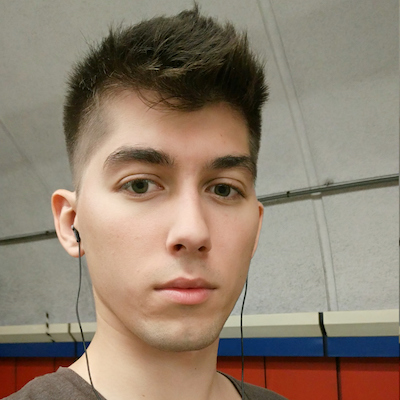 Piotr Szlachciak]

<!-- .card[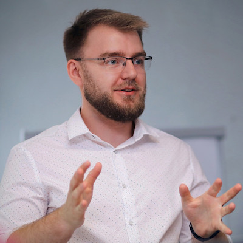 Michał Bury] -->
<!-- .card[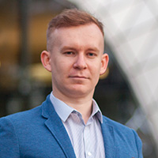 Piotr Kowalski] -->
<!-- .card[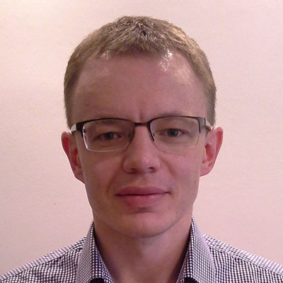 Andriy Mykulyak] -->
<!-- .card[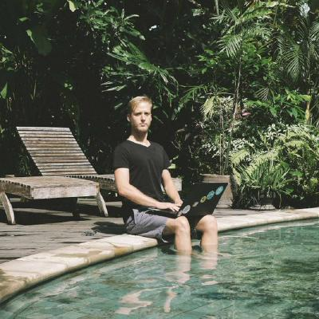 Kuba Strebeyko] -->
<!-- .card[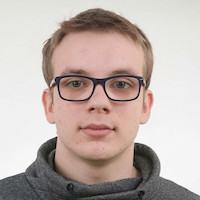 Krzysztof Łokaj] -->
<!-- .card[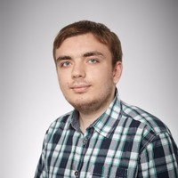 Ivan Rukhavets] -->
<!-- .card[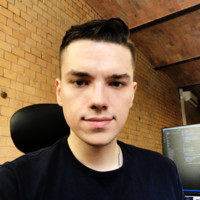 Michał Załęcki] -->
<!-- .card[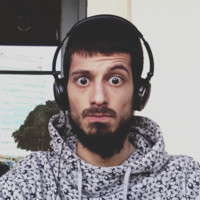 Sijawusz Pur Rahnama] -->
<!-- .card[ Piotr Zientara] -->
<!-- .card[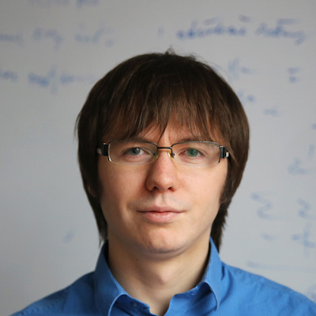 Robert Kawecki] -->
<!-- .card[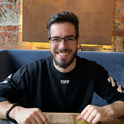 Rafał Sosnowski] -->
<!-- .card[ Tomasz Budrewicz] -->
<!-- .card[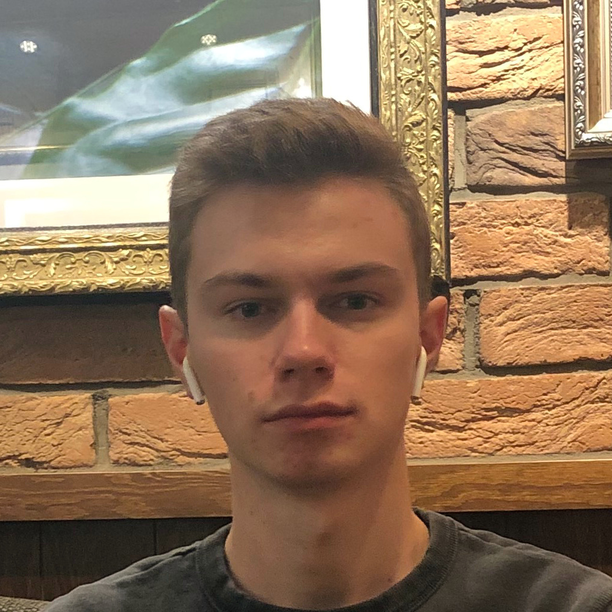 Dmytro Maretskyi] -->
<!-- .card[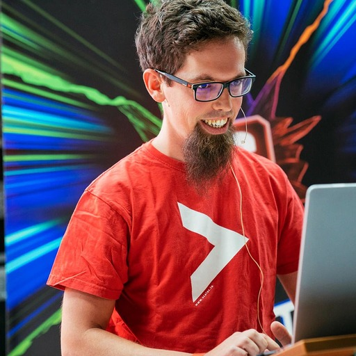 Chris Trześniewski] -->
<!-- .card[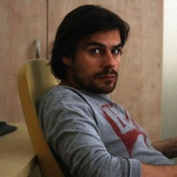 Robert Gurgul] -->
<!-- .card[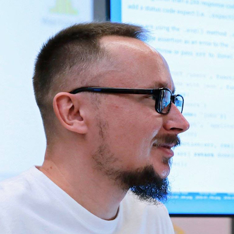 Rafał Pocztarski] -->
<!-- .card[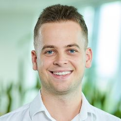 Przemysław Struciński] -->
<!-- .card[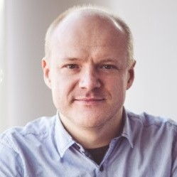 Łukasz Basaj] -->
<!-- .card[ Bartosz Legięć] -->
<!-- .card[ Jacek Mikrut] -->
<!-- .card[ Piotr Kowalski] -->
<!-- .card[ Piotr Szlachciak] -->
<!-- .card[ Łukasz Borawski] -->
<!-- .card[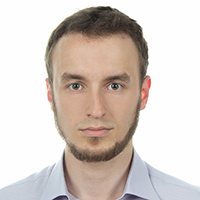 Jakub Skałecki] -->
<!-- .card[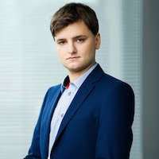 Michał Szklarski] -->
<!-- .card[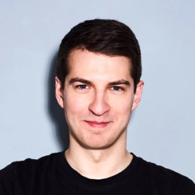 Paweł Mysior] -->
<!-- .card[ Tatiana Platonova] -->
<!-- .card[ Piotr Zientara] -->
<!-- .card[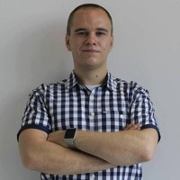 Daniel Siwek] -->
<!-- .card[ Rafał Pocztarski] -->
<!-- .card[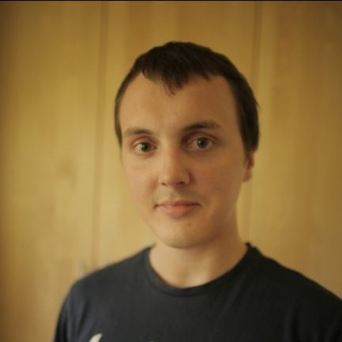 Łukasz Godziejewski] -->
<!-- .card[ Tomasz Budrewicz] -->
<!-- .card[ Piotrek Koszuliński] -->
<!-- .card[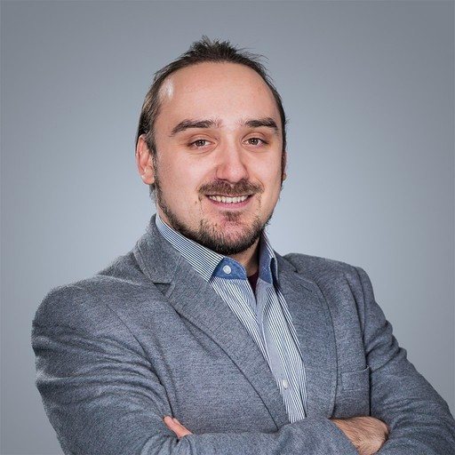 Krzysztof Syrytczyk] -->
<!-- .card[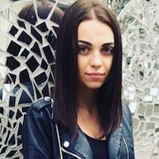 Nataliya Pasichnyk] -->
<!-- .card[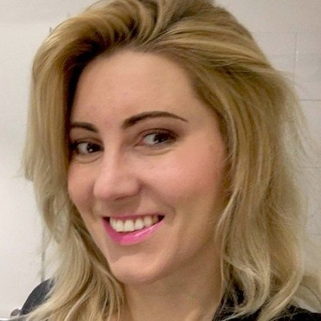 Anna Guz] -->
<!-- .card[ Mateusz Chrzonstowski] -->
<!-- .card[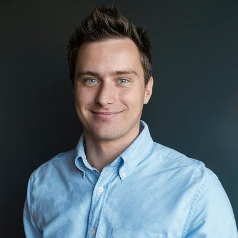 Marek Kirejczyk] -->
<!-- .card[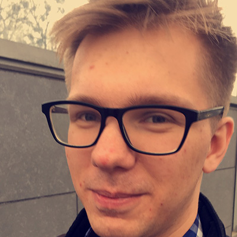 Bartłomiej Rutkowski] -->
<!-- .card[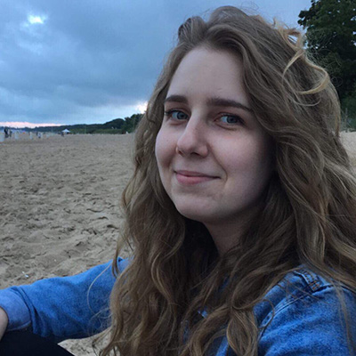 Justyna Broniszewska] -->
<!-- .card[ Kamil Gajowy] -->
<!-- .card[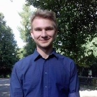 Wojtek Przechodzeń] -->
<!-- .card[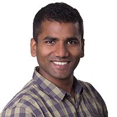 Vivek Patel] -->

---

class: middle, center, slide-card-list, slide-card-list-rounded

.size50[

# 👩‍🏫 Assistant Trainers and Volunteers 👨‍🏫

]

.card[ Łukasz Basaj]
.card[ Mirosław Stasiak]

.card[ Kuba Strebeyko]
.card[ Nataliya Pasichnyk]

<!-- .card[ Daniel Karski] -->
<!-- .card[ Marcin Hagmajer] -->

<!-- .card[ Kamil Grabek] -->
<!-- .card[ Piotr Szlachciak] -->

<!-- .card[ Michał Bury] -->
<!-- .card[ Piotr Kowalski] -->
<!-- .card[ Andriy Mykulyak] -->
<!-- .card[ Krzysztof Łokaj] -->
<!-- .card[ Ivan Rukhavets] -->
<!-- .card[ Michał Załęcki] -->
<!-- .card[ Sijawusz Pur Rahnama] -->
<!-- .card[ Piotr Zientara] -->
<!-- .card[ Robert Kawecki] -->
<!-- .card[ Rafał Sosnowski] -->
<!-- .card[ Tomasz Budrewicz] -->
<!-- .card[ Dmytro Maretskyi] -->
<!-- .card[ Chris Trześniewski] -->
<!-- .card[ Robert Gurgul] -->
<!-- .card[ Rafał Pocztarski] -->
<!-- .card[ Przemysław Struciński] -->
<!-- .card[ Bartosz Legięć] -->
<!-- .card[ Jacek Mikrut] -->
<!-- .card[ Piotr Kowalski] -->
<!-- .card[ Piotr Szlachciak] -->
<!-- .card[ Łukasz Borawski] -->
<!-- .card[ Jakub Skałecki] -->
<!-- .card[ Michał Szklarski] -->
<!-- .card[ Paweł Mysior] -->
<!-- .card[ Tatiana Platonova] -->
<!-- .card[ Piotr Zientara] -->
<!-- .card[ Daniel Siwek] -->
<!-- .card[ Rafał Pocztarski] -->
<!-- .card[ Łukasz Godziejewski] -->
<!-- .card[ Tomasz Budrewicz] -->
<!-- .card[ Piotrek Koszuliński] -->
<!-- .card[ Krzysztof Syrytczyk] -->
<!-- .card[ Anna Guz] -->
<!-- .card[ Mateusz Chrzonstowski] -->
<!-- .card[ Marek Kirejczyk] -->
<!-- .card[ Bartłomiej Rutkowski] -->
<!-- .card[ Justyna Broniszewska] -->
<!-- .card[ Kamil Gajowy] -->
<!-- .card[ Wojtek Przechodzeń] -->
<!-- .card[ Vivek Patel] -->

---

class: middle, center, slide-middle-images, slide-card-list,

.size50[

# Sponsors

]

.card[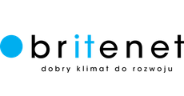]
.card[]

<!-- .card[ Wallaby.js] -->

<!-- ---

class: middle, center, slide-middle-images

.size50[

# Thank you!

]

 -->

---

class: middle, center, slide-middle-images, slide-card-list,

.size50[

# Partners

]

.card[]
<!-- .card[ Wallaby.js] -->

<!-- ---

class: middle, center, slide-middle-images

.size50[

# Thank you!

]

 -->

---

.size50[

# Agenda 📋

]

9:45 - Opening

10:00 - Session I

11:00 - Session II

12:00 - 12:30 - Lunch break

12:30 - Session III

13:30 - Session IV

14:25 - Survey

14:30 - Closing

---

.size50[

# Rules 📋

]

* 4 sessions

* One sesion - one hour

* 25 minutes for the coach

* 25 minuts for practice

* 10 minuts for summary and short break

<!-- --- -->

<!-- class: middle, center

# Slack

<svg width="200" height="200" viewBox="0 0 256 256" xmlns="http://www.w3.org/2000/svg" preserveAspectRatio="xMidYMid"><path d="M165.964 15.838c-3.89-11.975-16.752-18.528-28.725-14.636-11.975 3.89-18.528 16.752-14.636 28.725l58.947 181.365c4.048 11.187 16.132 17.473 27.732 14.135 12.1-3.483 19.475-16.334 15.614-28.217L165.964 15.838" fill="#DFA22F"/><path d="M74.626 45.516C70.734 33.542 57.873 26.989 45.9 30.879 33.924 34.77 27.37 47.631 31.263 59.606l58.948 181.366c4.047 11.186 16.132 17.473 27.732 14.132 12.099-3.481 19.474-16.332 15.613-28.217L74.626 45.516" fill="#3CB187"/><path d="M240.162 166.045c11.975-3.89 18.526-16.75 14.636-28.726-3.89-11.973-16.752-18.527-28.725-14.636L44.708 181.632c-11.187 4.046-17.473 16.13-14.135 27.73 3.483 12.099 16.334 19.475 28.217 15.614l181.372-58.93" fill="#CE1E5B"/><path d="M82.508 217.27l43.347-14.084-14.086-43.352-43.35 14.09 14.089 43.347" fill="#392538"/><path d="M173.847 187.591c16.388-5.323 31.62-10.273 43.348-14.084l-14.088-43.36-43.35 14.09 14.09 43.354" fill="#BB242A"/><path d="M210.484 74.706c11.974-3.89 18.527-16.751 14.637-28.727-3.89-11.973-16.752-18.526-28.727-14.636L15.028 90.293C3.842 94.337-2.445 106.422.896 118.022c3.481 12.098 16.332 19.474 28.217 15.613l181.371-58.93" fill="#72C5CD"/><path d="M52.822 125.933c11.805-3.836 27.025-8.782 43.354-14.086-5.323-16.39-10.273-31.622-14.084-43.352l-43.36 14.092 14.09 43.346" fill="#248C73"/><path d="M144.16 96.256l43.356-14.088a546179.21 546179.21 0 0 0-14.089-43.36L130.07 52.9l14.09 43.356" fill="#62803A"/></svg> -->

<!-- ## #workshop-45

**Dostęp możliwy, kiedy dostaniesz zaproszenie.** -->

<!-- ---

class: middle, center

.size70[

# Kto jest pierwszy raz na wydarzeniu?

] -->

<!-- ---

# Przerwy 🏖

.size50[

* Social media break: **11:30 — 11:45**
* Lunch: **13:00 — 13:45**
* Activity break: **15:30 — 15:45**

]

Możliwe są dodatkowe przerwy, o których decyduje trener. -->

---

class: middle, center

# 💎 Project name 💎

.size50[

## <mark>warsawjs-workshop-45-*</mark>

]

---

# Event Summary

.size40[

* We finish coding at **2:25 pm**
* Survey: [bit.ly/warsawjs-workshop-45-ankieta](https://bit.ly/warsawjs-workshop-44-ankieta)
* **Summary Time for each group!**

]

---

class: middle, center

# 🏆 Contest 🏆

## JetBrains Raffle for publishing `#warsawjs` tag

---

class: middle, center

# Let's go!

<!-- Zapraszamy mentora na scenę 👨🏼‍🏫 -->
👩‍💻 • 👨‍💻

---

class: middle, slide-invert-colors

# Learning in progress...

---

class: middle, center

# We finish &#x23F0; at <mark>14:30</mark>

---

class: middle

# [1/5] Ankieta 📑

## [bit.ly/warsawjs-workshop-45-ankieta](https://bit.ly/warsawjs-workshop-45-ankieta)

* Thank you for filling our surveys
* Thanks to them we can develop
* The survey is anonymous

---

class: middle

# [2/5] Presentations! &#x1F4A5;

## What each group learned today?

---

class: middle

# [3/5] Raffle time &#x1F381;

## `#warsawjs` Hashtag

* [Twitter](https://twitter.com/hashtag/warsawjs?f=tweets&vertical=default)
* [Instagram](https://www.instagram.com/explore/tags/warsawjs/)
* [Facebook](https://www.facebook.com/hashtag/warsawjs)

---

class: middle, center, slide-middle-images, slide-card-list,

.size50[

# [4/5] Thank you Sponsors ❤️

]

.card[]
.card[]

---

class: middle

# [5/5] Thank you ❤️

## ...for the WarsawJS team!

---

class: top, center
background-image: url('images/community.jpg')

# <mark>Photo! 📸</mark>

---

class: middle, center

# ⭐️ Next Workshop ⭐️

## Functional Programming
### WarsawJS Workshop #46
#### Sunday, July 19, 2020

---

class: middle, center

# Let's go!

<!-- Zapraszamy mentora na scenę 👨🏼‍🏫 -->
👩‍💻 • 👨‍💻

---

class: middle, center

.slide-card-list[

.card.size70[Thank&nbsp;you for&nbsp;being&nbsp;here]
.card[]

]
